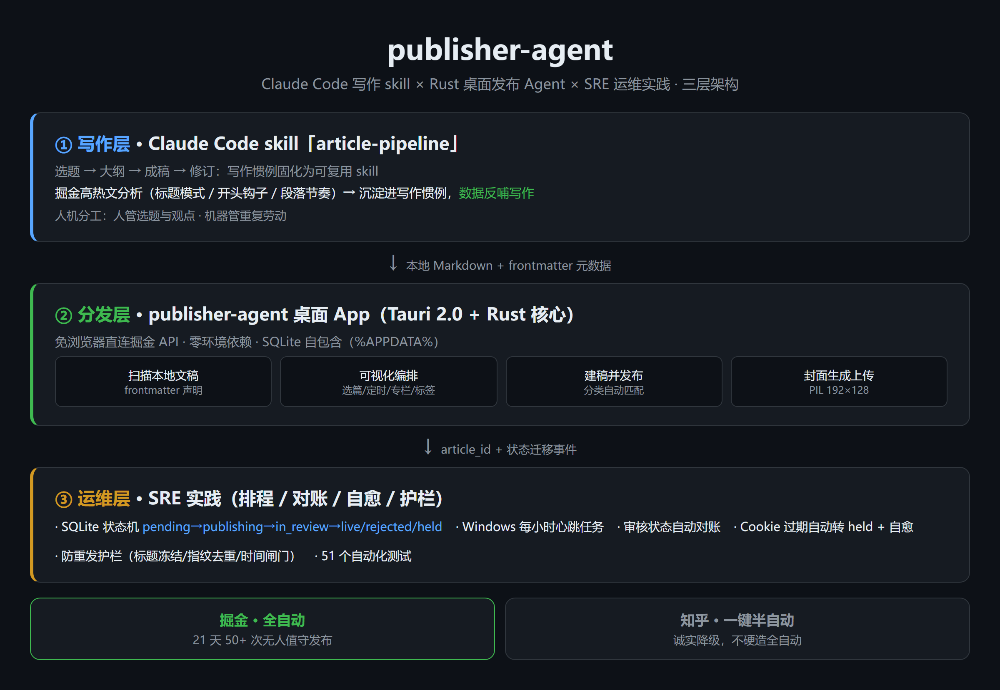

# publisher-agent

一条个人**文章生产线**：Claude Code 写稿 → 桌面 Agent 编排 → 无人值守发布到掘金，SRE 方式运维（排程 / 对账 / 自愈 / 护栏）。

**实测（2026-09-18 → 10-09，21 天）**：状态机管理 54 个条目、掘金全自动发布 50+ 篇、7 个专栏 62 篇挂载、494 条事件全审计，单篇分发操作 0 分钟。配套写作层 skill 见 [juejin-publisher-pro](https://clawhub.ai/skills/juejin-publisher-pro)。



## 三层架构

| 层 | 组件 | 职责 |
|---|---|---|
| ① 写作层 | Claude Code skill（[juejin-publisher-pro](https://clawhub.ai/skills/juejin-publisher-pro)） | 选题→大纲→成稿→修订；高热文分析沉淀写作惯例，人管观点、机器管重复 |
| ② 分发层 | **publisher-agent 桌面 App**（本仓库） | 扫描本地 Markdown（frontmatter 元数据）→ 可视化编排（选篇/定时/专栏/标签/摘要）→ 免浏览器直连掘金 API 建稿发布 → PIL 封面生成上传 → 专栏/分类自动匹配 |
| ③ 运维层 | 内置于 App | SQLite 状态机 · Windows 每小时心跳 · 审核状态自动对账 · Cookie 过期自愈 · 防重发护栏 |

技术栈：**Tauri 2.0 壳 + Rust 核心**（reqwest + rusqlite bundled），数据自包含于 `%APPDATA%\publisher-agent\data.db`，零环境依赖。知乎已剥离为 CDP 一键半自动（诚实降级，不硬造全自动）。

## 功能

- **内容扫描**：递归扫描本地博客目录，读取 frontmatter（掘金标题/摘要/分类/标签/专栏）
- **可视化编排**：选篇、定时（精确到分）、专栏匹配（大小写/分隔符无关）、标签编辑、UI 与 plan.yaml 双向同步
- **自动发布**：建稿 → 分类/标签/摘要 → 封面生成上传 → 挂专栏 → 发布，全程无需浏览器
- **状态机**：`pending → publishing → in_review → live / rejected / held`，rejected 冻结永不自动重投
- **每小时心跳**：Windows 计划任务驱动 `--tick`（对账 → 轮询审核 → 选篇 → 发布 → 落库），队列发完自动停跳
- **自愈**：Cookie 过期自动转 `held` 并 toast 提醒，扫码恢复后自动回 `pending` 续跑
- **防重发护栏**：已发标题冻结 + 内容指纹（sha256 前 8 位）去重 + 发布时间闸门
- **测试**：Rust 13 个集成测试（截断/frontmatter/plan/状态机/专栏匹配/set_field/指纹）+ Python 38 个单元/集成测试

## 快速开始

```bash
# 桌面 App（推荐）
cd desktop
npm install
npm run tauri dev      # 开发
npm run tauri build    # 打包 NSIS 安装包

# 或 CLI 模式（计划任务心跳同款入口）
desktop/src-tauri/target/release/publisher-agent-desktop.exe --tick          # 干一轮
desktop/src-tauri/target/release/publisher-agent-desktop.exe --tick --dry    # 干跑不真发
desktop/src-tauri/target/release/publisher-agent-desktop.exe --publish-now 01  # 立即发布指定条目
```

首次使用：App 内「凭据」页扫码登录掘金（Playwright 独立 Chromium，Cookie 存 SQLite，实测有效期约 1 年）。

## 设计红线

- **外发动作唯一入口是 Rust 核心**，UI/CLI 只读写本地状态
- **rejected 永不自动重投**（相似内容重发会被更快驳回）——重写需新条目 + 人工确认
- **发布时刻冻结标题+指纹**——之后改文件/改标题不触发任何重发
- **跨进程文件锁**——tick 与立即发布互斥，杜绝并发互相覆盖状态
- 队列发完**停用而非删除**心跳任务（防静默死亡，可一键重启）

## 仓库结构

```
desktop/            # Tauri 2.0 桌面 App（当前主体）
  src-tauri/        #   Rust 核心：juejin.rs（掘金 API）agent.rs（状态机/管线）main.rs（IPC/CLI）
  ui/               #   纯静态前端（无框架）
publisher_agent/    # Python 辅助插件（md→html、封面生成、登录扫码）
tests/              # Python 侧测试；Rust 测试在 src-tauri/tests/
docs/               # 架构图等
```

## 关联项目

- [juejin-publisher](https://github.com/Thneoly/juejin-publisher) —— 前身：Python 引擎 + ClawHub skill
- [juejin-publisher-pro](https://clawhub.ai/skills/juejin-publisher-pro) —— 写作/发布 skill（ClawHub 市场，`clawhub install juejin-publisher-pro`）

## 伦理边界

依赖逆向接口与 CDP 自动化，仅供个人内容发布；遵守发布纪律（每日 1~2 篇），勿批量营销号式发布。
